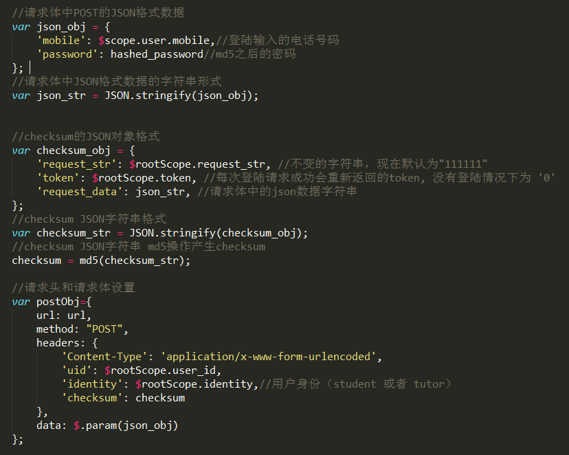

#auth 
#### Description
登陆认证
#### Resquet Method
POST


#### Request Header 请求头中传的参数
######uid没有登陆情况下为整形integer零 0
######token没有登陆情况下为字符串零 ‘0’
######identity 根据用户选择的身份，student 或者 tutor
######checksum由三个步骤算出，参考下面图片JS代码和注释，包含token安全验证以及post数据完整性校验功能

| Name | Type | Mandatory | Default | Description |
| -- | -- | -- | -- | -- |
| uid | int | YES |  | 0 |
| identity    | String | YES |  | tutor 或者 student|
| checksum    | String | YES |  | checksum|


#### Request Parameters (Body)

| Name | Type | Mandatory | Default | Description |
| -- | -- | -- | -- | -- |
| mobile | String | YES |  | mobile |
| password    | String | YES |  | md5(password) |



#####说明：服务器端会用请求体中传来的数据和 token request_str 计算checksum，再和请求头中的checksum比较。

#### Response
| Name | Type | Mandatory | Default | Description |
| -- | -- | -- | -- | -- |
| Auth Response | JSON | YES| | Auth Response |


#### Request Example

|Request URL | "http://112.74.81.48/zhihuieducation/authcontroller/auth" |
| --| -- |
| | |

#### Response Example

#####只有retcode 为0 才是成功响应，其他都是错误响应
```
{
    retcode: 0, 
    retmsg: "成功登陆",
    response: {
        head_photo: "http://112.74.81.48/zhihuieducation/webApp/app/res/tutor_photo/6.jpg",
        mobile: "13409610529",
        name: "陈大文",
        token: "d57c8ab7e18df9cd261892ba81578c8ccbea3f02",
        user_id: 1
    }
}

其他错误响应情况

{
    retcode: 1, 
    retmsg: "此用户不存在",
    response: {
    }
}


{
    retcode: 1, 
    retmsg: "密码错误",
    response: {
    }
}

可能是丢失数据，或者token无效或者过期，提示用户重新登陆
{
    retcode: 2, 
    retmsg: "验证无法通过，请重新登陆",
    response: {
    }
}
```


